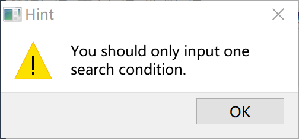

# 学生成绩管理系统

面向对象程序设计 期末大作业

3150104785 郝广博

3150104804 赵翔宇

3150104802 桂晓琬

3150104957 张正年

GitHub: [awmleer/gradeManagement](https://github.com/awmleer/gradeManagement)

## 总述

TODO


## 分工

- GUI：桂晓琬 赵翔宇
- 数据库操作：张正年 郝广博


## SQLite数据库操作

由于成绩管理系统设计较多的数据操作，因此我们采用了本地SQLite数据库。通过QT内置的`QSql`模块，可以非常方便的实现SQL操作。

对于所有数据库的操作，都被放置在了`Db`这个命名空间下面，GUI逻辑层不会直接调用`Db`命名空间的函数，而是通过数据模型的class做间接调用（具体可参加下面对数据模型的介绍）。

### 数据库初始化

数据库初始化主要包括两件事情：

1. 建立和本地数据文件的连接。

   ```c++
   db = QSqlDatabase::addDatabase("QSQLITE");
   db.setDatabaseName("db.sqlite");
   ```

2. 初始化数据库的表定义。

   为了防止重复建立表，我们使用了`CREATE TABLE IF NOT EXISTS`语句。

### 数据库定义（DDL）

一共有三张表，分别为`student`、`course`、`grade`。

```sql
CREATE TABLE IF NOT EXISTS student (
  id INTEGER PRIMARY KEY,
  name VARCHAR(30),
  type VARCHAR(10), -- 'undergraduate' | 'master' | 'doctor'
  enrollmentYear SMALLINT
);

CREATE TABLE IF NOT EXISTS course (
  id INTEGER PRIMARY KEY AUTOINCREMENT,
  name VARCHAR(30) UNIQUE,
  description VARCHAR(200)
);

CREATE TABLE IF NOT EXISTS grade (
  id INTEGER PRIMARY KEY AUTOINCREMENT,
  studentId INTEGER NOT NULL,
  courseId INTEGER NOT NULL,
  takeTime VARCHAR(20), -- eg. '2016first', '2015second'
  score INTEGER,
  FOREIGN KEY (courseId) REFERENCES course(id),
  FOREIGN KEY (studentId) REFERENCES student(id)
);
```


## 数据模型定义

对于这个项目，一共需要三种数据模型：**学生**、**课程**、**成绩**。

为了逻辑上的清楚，我们把最最底层的数据库操作封装在了这三个类中，从而避免了逻辑层直接调用底层数据库函数。

### 学生

```c++
class Student{
public:
    Student(int id, QString name, QString type, int enrollmentYear);
    int getId();
    QString getName();
    void setName(QString name);
    QString getType();
    void setType(QString type);
    int getEnrollmentYear();
    void setEnrollmentYear(int enrollmentYear);
    bool save();
    bool remove();
    static int create(int id, QString name, QString type, int enrollmentYear);//returns the studentId if success, else returns -1
    static vector<Student> all();
    static vector<Student> searchById(int id);//exact match
    static vector<Student> searchByName(QString name);//fuzzy match
    static vector<Student> searchByType(QString type);//exact match
private:
    int id;
    QString name;
    QString type;
    int enrollmentYear;
};
```

### 课程

```c++
class Course{
public:
    Course(int id, QString name, QString description);
    int getId();
    QString getName();
    void setName(QString name);
    QString getDescription();
    void setDescription(QString description);
    bool save();
    bool remove();
    static int create(QString name, QString description);//returns the courseId if success, else returns -1
    static vector<Course> all();
    static vector<Course> searchById(int id);//exact match
    static vector<Course> searchByName(QString name);//fuzzy match
private:
    int id;
    QString name;
    QString description;
};
```

### 成绩

```c++
class Grade{
public:
    Grade(int id, int studentId, int courseId, QString takeTime, int score);
    int getId();
    int getStudentId();
    int getCourseId();
    QString getTakeTime();
    void setTakeTime(QString takeTime);
    int getScore();
    void setScore(int score);
    Student fetchStudent();
    Course fetchCourse();
    bool save();
    static int create(int studentId, int courseId, QString takeTime, int score);//returns the courseId if success, else returns -1
    bool remove();
    static vector<Grade> all();
    static vector<Grade> searchById(int id);
    static vector<Grade> searchByCourseId(int courseId);
    static vector<Grade> searchByStudentId(int studentId);
    static vector<Grade> searchByTakeTime(QString takeTime);
    static vector<Grade> searchByScore(int min, int max);//score>=min && score<=max
private:
    int id;
    int studentId;
    int courseId;
    QString takeTime;
    int score;
};
```

对于以上三个类，他们的私有属性基本是和数据库的表定义相一致的，通过get和set函数来实现访问和赋值。

每一个类都有`create()`、`save()`、`remove()`函数，其中，`create()`是静态函数，用来在数据库中创建一条相应的记录，如果插入成功返回新增记录对应的id；`save()`是用来把实例修改后的值保存到数据库中（调用`setName()`等函数是不会自动把改动提交到数据库的）；`remove()`是用来把实例对应数据库中的记录删除（并不会删除实例本身）。

对于每一个类，也都有配套的搜索函数，用来做查询，这些搜索函数都是静态函数，返回的类型也都是`vector`。这些搜索函数，本质上并未做特殊的逻辑处理，而是把参数转发给了`Db`模块对应的数据库操作函数。

最后，`grade`类还有`fetchStudent()`和`fetchCourse()`方法，用来获取到某条成绩对应的学生和课程信息，这两个函数本质上也是对`Db`模块下的搜索函数做了封装，但是却对逻辑层的调用来说方便了很多。


## UI界面设计

UI界面一共分为七块：**主界面**、**课程查找**、**课程添加**、**学生查找**、**学生添加**、**成绩查找**、**成绩添加**。

### 主界面MainWindow

主界面是六个主要功能的入口，为了友好，我们插入了一张欢迎的图片。

最上栏我们设置了课程管理、学生管理、成绩管理三大类。


每个大类都可以有两个选项窗。


第二栏可以直接点击到六项功能的任何一项

### 课程查找CourseSelection

**所有查找功能都会有提示，只能输入一个搜索条件，否则会出现错误！**



进入课程查询界面，可以输入课程id或课程名，点击search即可在下方看到结果。

如果是无条件查询，可以直接点击search all。


### 课程管理CourseManagement

在这里可以进行课程的增删。

添加一门新的课程，需要输入课程名和课程描述，系统会自动分配课程号。

如果需要删除一门课，输入课程的ID，点击remove，即可删除此门课。


### 其他界面OtherWindows

**学生查询、增删和成绩查询、增删大致相同，在此仅给出界面。**


